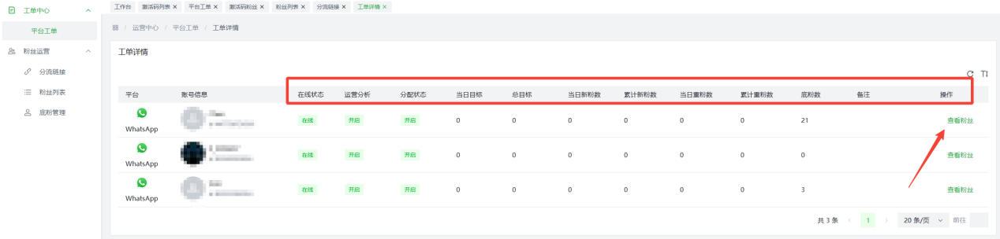
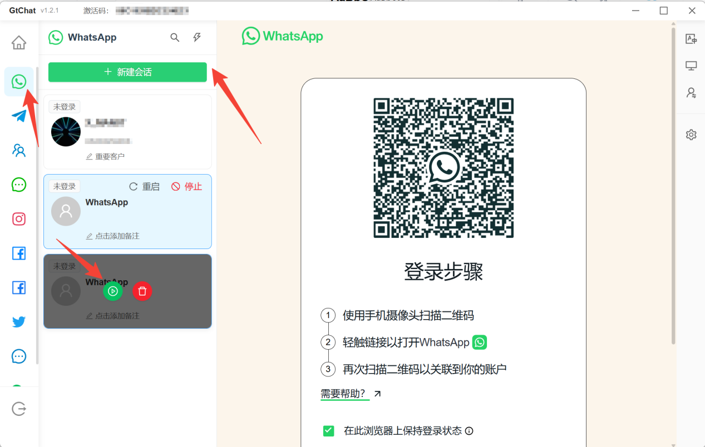
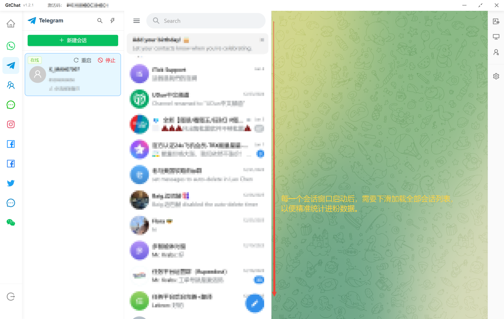
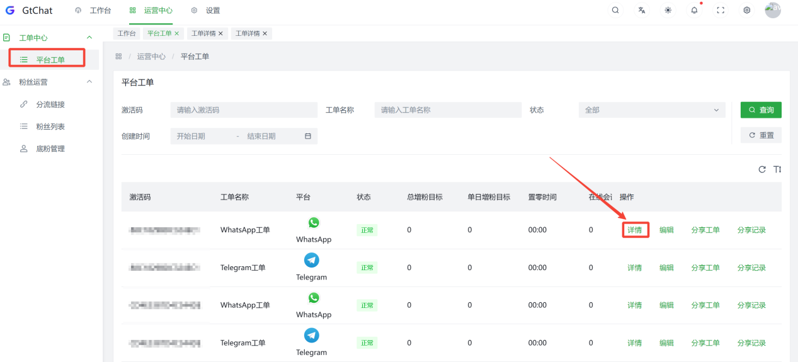
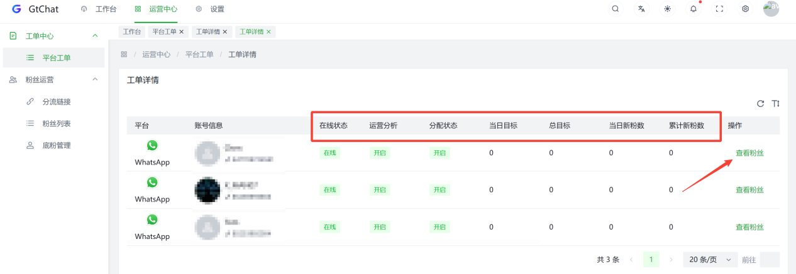
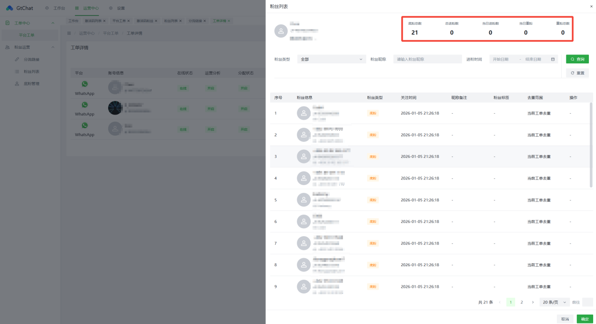

## 平台工单

工单主要用于您的进粉及客服工作量统计及管理工单是激活码创建后自动生成，在管理后台
「 平台工单 」 可进行管理 ；

单个激活码，可存在多个平台工单，并管理对应平台的账号台（WS、LINE、TG、Zalo、LINE-WORKS）；

管理者可以看到各个工单的进粉数据，方便对员工工作情况进行了解和查看。

工单详情可以查看详细数据如账号、用户信息、备注、累计粉丝、在线状态等（如图）；

### 工单使用教程

您可以在主管后台中找到"设置"→"激活码列表"页面
。然后找到"新建激活码"按钮，新建完成后返回列表，
复制刚刚创建的激活码交给客服去GtChat客户端完成登录。

把在管理后台复制的激活码，粘贴，点击登录即可。

选择想创建工单的平台，点击【新建会话】点击启动按钮，扫码登录社交账号；

为保障您的工单计数（打粉）的准确性，需要将登录中的社交账号向下滑动，加载此账号列表中的全部"联系人"完成粉丝上报行为；

您可以在"工单详情"中找到这个社交账号及当前社交账号进粉明细；

### 分流链接

分流链接用于您进行社交渠道推广，在一条链接中包含多个您需接粉客服账号的链接合集，通过多种分配方式将流量分配给您对应的接粉客服；

新建分流链接

点击创建分流链接 , 完成相关设置，目前
WhatsApp、Telegram等平台支持创建使用分流链接，使用分流链接给账号营销使用，实时查看点击状况，进一步实现营销转化；

#### 分流链接讲解

1 . 填写分流链接名称；

2 . 选择分流链接的平台； 目前支持WhatsApp、Telegram等多个平台；

3 . 选择分流号码； 工单主号（群组/自定义-即将上线）；

4 . 选择分流模式；分流号码不同，分流模式对应不同。

"工单主号"对应"仅在线/全部分配"

5 .
用户绑定；开启后，同一IP每次访问，都固定同一个主号，防止相同客户添加多个号码

6 . 短链数量；上限50个

7 . 分流链接地址；可指定跳转地址（指定某个号的链接，或特定的网页地址）

状态；该分流链接是否启用

过期时间；该分流链接的有效期限

### 粉丝列表

在工单详情页点击查看粉丝当可查看该激活码下所有粉丝的数据，其中客户信息、粉丝类型可修改，粉丝类型支持多选批量修改；

### 底粉管理

