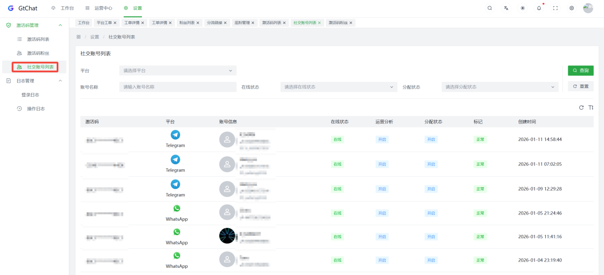

## 创建激活码、员工在桌面端登号

### 设置激活码

先登录系统主管端，然后点击
【激活码管理】，点击【新建】，进入弹窗，根据需求，完成相关设置（如果想要快速投入使用，只需填写备注信息，其他选择默认即可），创建完激活码后，将激活码、桌面端下载网址发给员工。

新建后可在激活码列表查看激活码，复制后可在桌面端进行登录。

### 全部员工营销账号

### 管理员快速管理账号：

在管理后台，点击【 激活码管理 】→【 社交账号列表 】

能查看WS/TG两个平台、全部员工的的营销账号状态，进行快速管理。

