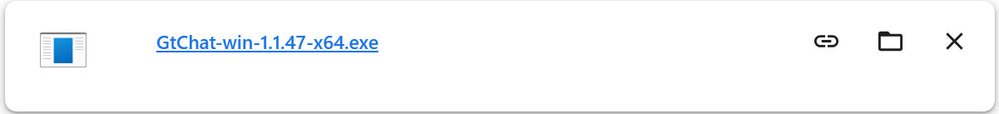
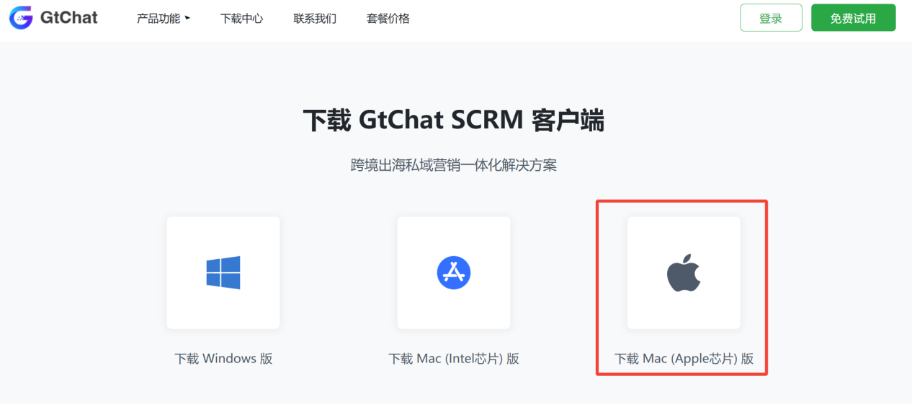
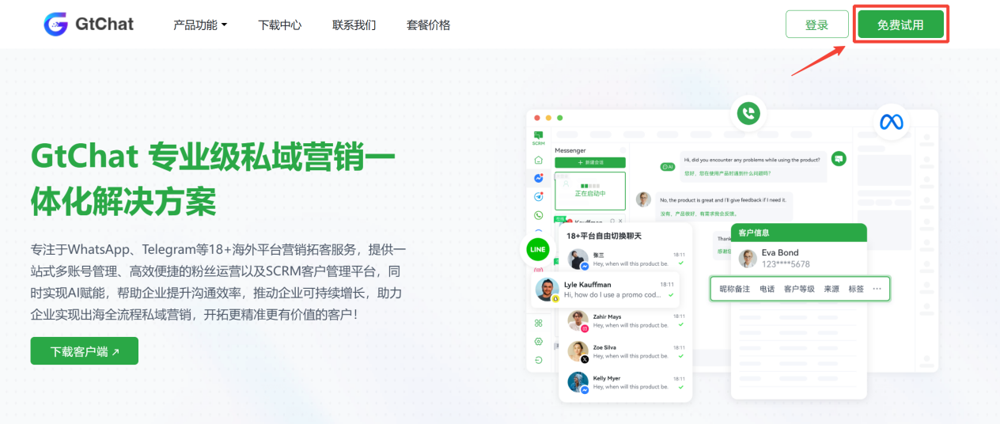
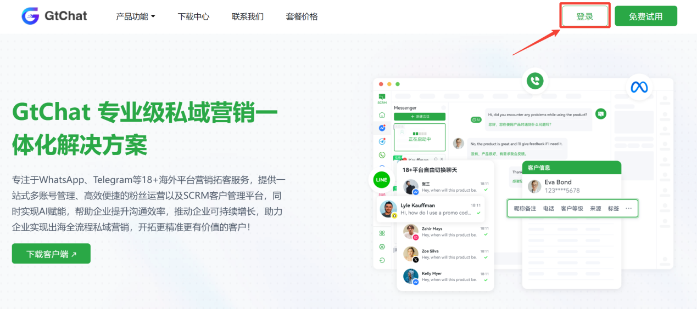

## 下载安装

### 下载客户端

1.访问官网在上方菜单栏点击下载中心

2.软件下载完成后，以 windows 电脑为例，进入下载文件的路径，双击运行。

3.安装并启动客户端

此页面即代表客户端安装完成

### 安装说明

#### Mac有2个安装包，怎么选择？

Mac电脑分为Intel（因特尔）芯片和Apple（苹果）芯片2种类型，点击桌面左上角的苹果图标，选择
【 关于本机 】 可以查看Mac电脑的芯片，如下图示就是Apple芯片的Mac电脑：

在下载页面要选择下载Mac（Apple芯片）版。

### 注册登录

#### 会员账号注册

在官网点击【登录】、【免费试用】，进入注册GtChat会员账号页面

新用户点击【去注册】，进行会员账号注册，用于登录会员平台

支持邮箱注册

未收到邮箱验证码，请查看邮箱【回收站】\~【垃圾箱】

#### 会员账号登录

在官网点击【登录】，进入GtChat会员账号登录页面

输入邮箱账号和密码点击登录。

#### 购买套餐

GtChat账号注册完成后登录管理后台可以直接购买套餐

登录管理后台在【首页】可以直接看到当前的套餐规格和有效期，点击【购买套餐】可以查看不同套餐的定价

点击切换套餐可对比

修改套餐规格，实时查看不同端口数、不同时间的套餐价格

使用余额抵扣部分套餐金额，3种可选支付方式

点击【立即支付】发起付款

注：支付走的是第三方平台，买卖双方均需支付部分手续费，实际付款的金额会大于套餐的标定金额，按照实际显示的金额完整支付，套餐会自动到账。

