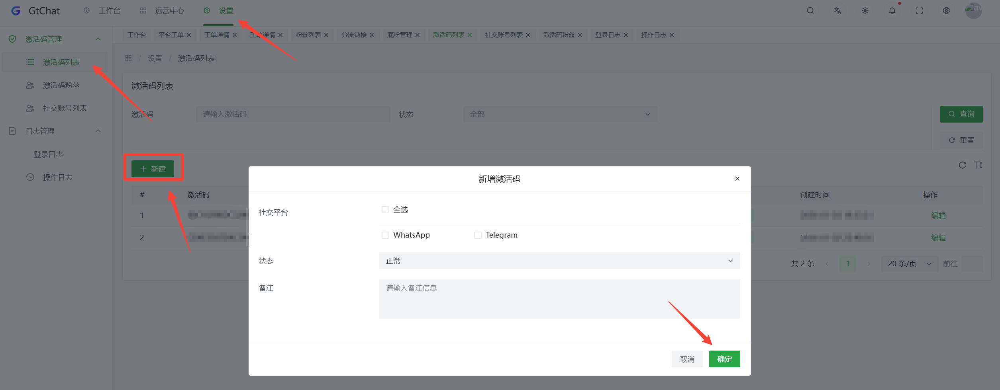
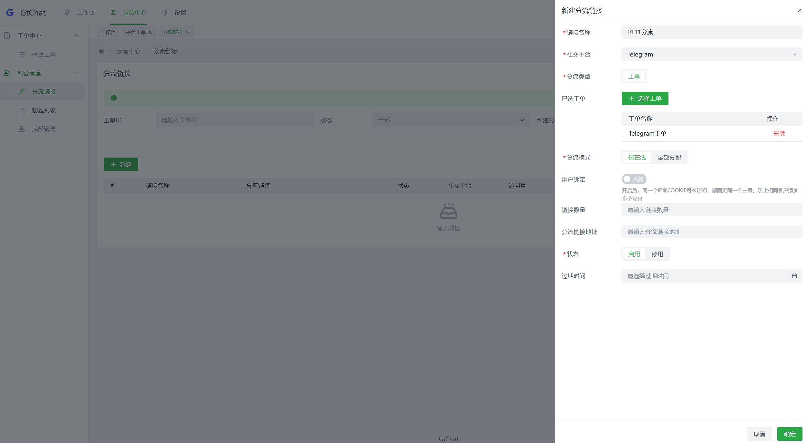
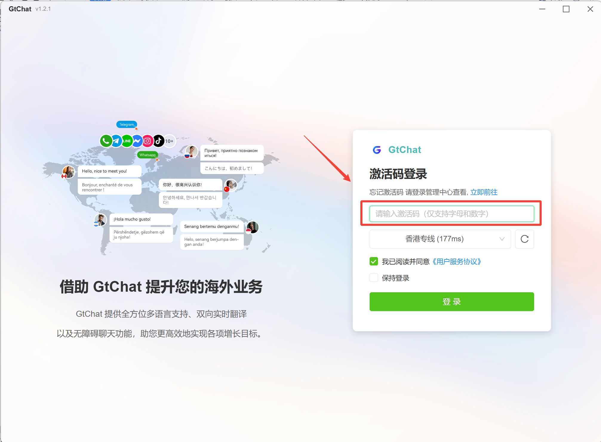

## 计数器教程：流量主使用教程

### 1.登录系统后台创建激活码

点击设置栏

点击【 激活码管理 】→【 激活码列表 】→【新建 】 按照需求设置内容 →【
确定 】

温馨提醒：激活码是 GtChat SCRM
系统的登录码，创建后可提供给交易方/员工登录GtChat SCRM系统使用。

### 2.发送激活码，数据报表（分享工单）给广告主

① 【 复制 】激活码 → 发送给【 广告主 】，对方通过激活码登录SCRM桌面端

②
分享工单生成数据报表，发给对方（广告主）用于双方查看账号的新增线索情况、结算流量。

在平台工单点击【分享工单】设置密码和过期时间。点击【确定】

显示 【 分享创建成功 】 后，把该数据报表（链接、密码）发给广告主。

③ 生成分流链接，放在自己引流渠道

用于双方查看账号的新增线索情况、结算。

点击【 粉丝运营 】 → 进入【 分流链接 】→ 点击【 新建 】做链接配置。

### 3.发送 GtChat 下载地址给广告主，下载GtChat SCRM桌面端

把官网下载中心网页地址复制发给广告主，→ 下载/打开 【 桌面端 】 → 输入 【
激活码 】 → 点击 【 登录 】

广告主打开【 桌面端 】→ 输入【激活码 】→ 点击【 登录 】

### 4.广告主登录要引流的账号

WhatsApp 平台为例，选中左侧 WhatsApp 图标，进入平台 → 点击【 新建会话
】→【 打开会话 】打开手机 WhatsApp
扫码登录即可，进入账号聊天界面，会话卡片左上角显示在线，说明登录成功

查看账号线索详情，有2种查看方式：

① 流量主通过系统后台，进行查看

在系统后台，点击【 工单中心 】→【 平台工单 】，选择【 对应工单
】点击【详情】进行查看

②双方通过数据报表（分享工单链接），进行查看

流量主操作：打开【 工单中心 】→【 平台工单 】，找到对应激活码【 工单名称
】→ 点击【 分享工单】→ 生成并分享工单链接 广告主操作：
打开工单数据报表的链接 → 查看账号的线索数

流量主操作：打开 【 工单中心 】 → 选择对应的工单点击【 分享工单 】
广告主操作： 打开工单数据报表的链接如下图 → 查看账号的线索数

