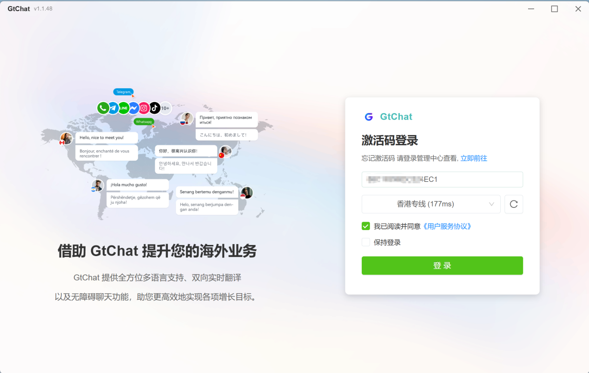
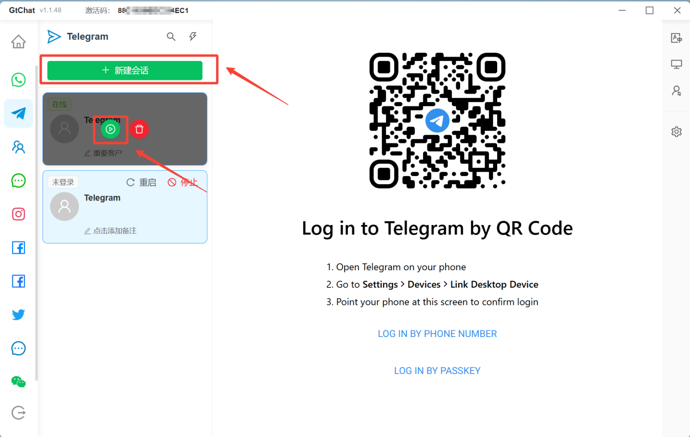
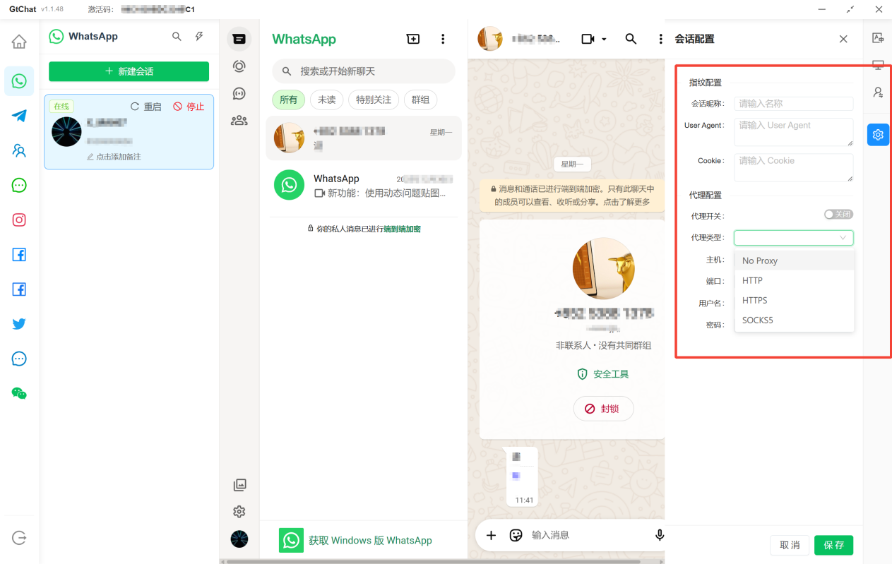

## 桌面端功能教程

### 员工快速登号

员工安装桌面端（下载安装），然后通过老板给的激活码，登录需要引流的账号，以TG账号为例。

点击 【新建会话】
→点击配置代理（看需求，默认本地IP），手机扫码登录TG账号，进入账号聊天页面，说明登号成功。（其他平台操作相同）

登录成功后请点击绿色启动按钮，即可开启聊天。如有多个会话需要同时启动请点击下图，批量开启会话按钮。

### 翻译设置

选择一个账号会话，在右侧栏找到 【 翻译设置
】，在这里可以为每个平台设置全局翻译线路（默认选择gpt-4o-mini），根据客户语言，客服销售人员可打开独立翻译开关，单独对客户设置语言。

### 会话配置-代理配置

通过设置代理服务器可隐藏真实的IP地址，增加网络隐私和安全性

平台支持不同社交账户配置不同的代理服务器，用于增加网络隐私和安全性；

您需要先关闭会话再添加代理信息，当前代理支持HTTP/HTTPS/SOCKS4/SOCKS5；

## 

