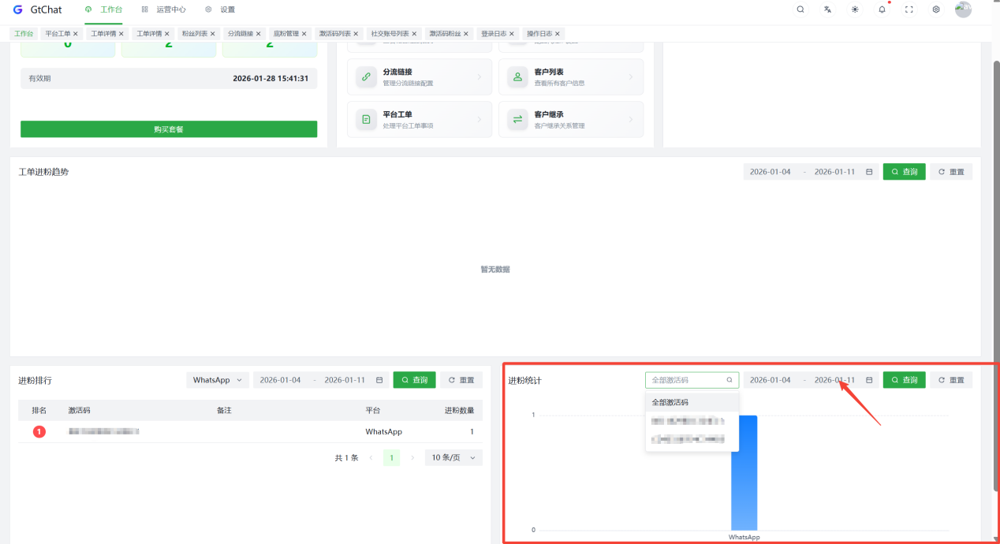

## 查看引流进粉数据+结算流量 相关教程

### 查看账号粉丝明细

有以下查看方式：

在系统后台【 工单中心 】，点击【 平台工单 】- 选择【 详情 】-
选择对应账号点击【 查看粉丝 】 - 进入【粉丝列表页】

### 粉丝列表页

根据粉丝明细的进粉，确认数据报表的正确！

双方通过数据报表结算流量
双方确认数据报表无误后，可按照【当日进粉数】进行结算 GtChat中的
当日进粉数 和 总进粉数 都已经去除过重粉，双方确认后可以直接用 当日进粉数
结算！

工单分享链接查看数据如下图

粉丝列表查看数据如下图

系统后台工作台也可查看对应激活码下的进粉统计数据。

